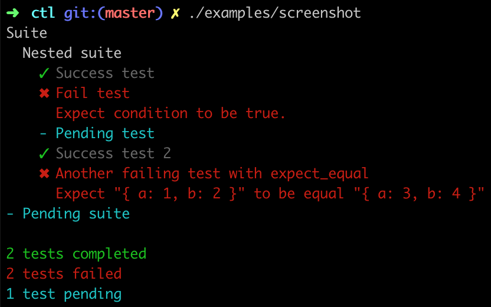
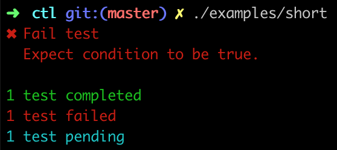

# CTL - C++ Testing Library

Simplest possible single-header C++14 testing library inspired by [mocha](https://mochajs.org).



Example:

```c++
	#include "ctl.h"

	using namespace ctl;

	int main() {
		describe("Some suite", []{
			describe("Inner suite", []{
				before([]{
					// do before all test in suit
				});
				before_each([]{
					// do before each test in suit
				});
				after_each([]{
					// do after each test in suit
				});

				it("Inner test", []{
					expect_ok(1 == 1);
				});

				it("Another inner test", []{
					expect_fail(1 == 2);
				});

				it("Failed inner test", []{
					expect_equal(1, 2);
				});

				describe("Pending inner suite");
			});

			it("Pending test");
		});
	}
```

Library uses lambdas to nicely structure tests and hooks. Tests are considered failed if they rised `std::exception`, expect_ok, expect_fail and expect_equal throws `std::runtime_error` with message about the failure.

To make test failure raise any std::exception based error:

```c++
	it("Will failure", []{
		throw std::runtime_error("Oops!");
	});
```

In the same way any custom checker could be implemented, see `examples/custom-check.cpp`.

## Reporters

### Spec(default)


### Short

To use code add to `main`:

```c++
	current_reporter.reset(new ctl::short_reporter());
```



## API

### describe(description, func)

```c++
	void ctl::describe(const std::string& description, std::function<void (void)> suit);
	void ctl::describe(const std::string& description);
```

Example:

```c++
	describe("Suit", []{
		// ...
	});
	describe("Pending Suit");
```

### it(description, func)

Tests should be inside describe sections(suits);

```c++
	void ctl::it(const std::string& description, std::function<void (void)> test);
	void ctl::it(const std::string& description);
```

Example:

```c++
	it("Test", []{
		// ...
	});
	it("Pending test");
```

### before(func)

Before hook could be used inside each describe section to execute something before all tests inside.
If hook is used before all describe sections, if will be executed before the first describe section.

```c++
	void before(std::function<void (void)> hook);
```

### after(func)

After hook could be used inside each describe section to execute something after all tests inside.
If hook is used outside all describe sections, if will be executed after all describe sections.

```c++
	void after(std::function<void (void)> hook);
```

### before_each(func)

Must be inside describe section. Executed before each non-pending test.

```c++
	void before_each(std::function<void (void)> hook);
```

### after_each(func)

Must be inside describe section. Executed after each non-pending test.

```c++
	void after_each(std::function<void (void)> hook);
```

### expect_ok(cond)

Check condition, if false throw exception with `message`.

```c++
	void ctl::expect_ok(bool condition, const std::string& message = "");
```

### expect_fail(cond)

Check condition, if true throw exception with `message`.

```c++
	void ctl::expect_fail(bool condition, const std::string& message = "");
```

### expect_equal(a, b, message)

Check a == b, if not throw exception with `message`.

```c++
	template<typename T> void ctl::expect_equal(const T& actual, const T& expected, const std::string& message = "");
```

Checker internally uses `operator==` to check equality and `std::stringstream` to add compared objects to the error message. To make custom classes work with it, you need to implement `bool operator==(const T&) const` and
`std::ostream& operator<<(std::ostream&, const T&)`. Example (from `examples/expect-equal.cpp`):

```c++
	class custom {
	public:
		custom(int a, int b): a(a), b(b) {}
		bool operator==(const custom& other) const {
			return this->a == other.a && this->b == other.b;
		}
		int a = 0;
		int b = 0;
	};

	std::ostream& operator<<(std::ostream &ss, const custom& c) {
		return ss << "{ a: " << c.a << ", b: " << c.b << " }";
	}
```
